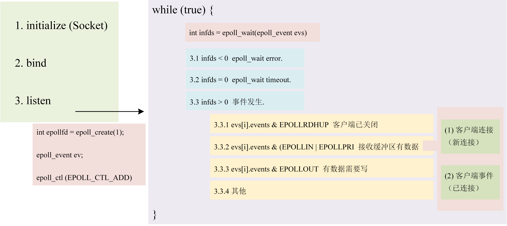

# Reactor Object Detect Server #
This repository implement ... based on C++, suporting IO and .
基于 C++ 实现主从 Reactor 模式高并发服务器（Base），支持 IO 和计算（Works）分离。



## 1. 开发环境
    (1) Visual Studio 2022.
    (2) CMake. Version is 3.16.
    (3) HuaWei cloud server.

## 2. 事项说明
    (1). Acceptor 运行在主进程（主事件循环 mainloop）；Connection 运行在 IO 线程池（在从事件循环 subloop），从事件循环由 IO 线程池管理。IO 线程池归 TcpServer 管理

    (2). Reactor 模型 IO 不会阻塞事件循环，但数据计算（业务处理）可能会阻塞事件循环。针对该问题，采用工作线程池（WORKS）。WORKS 线程池归业务 EchoServer 管理

    (3). 若工作线程还未处理完计算任务，而客户端此时关闭（断开）连接，导致 TcpServer::closeconnection 被调用，造成 Connection 野指针出现，导致程序崩溃。针对野指针这类情况，解决办法： Connection 采用智能指针 shared_ptr 和 unique_ptr

    (4). 若客户端已经断开，那么是否继续发送数据已经变得不重要，需要将 fd 从 epollfd 中移除

    (5). 若在 IO 线程将发送的信息写入发送缓冲区，在 WORKS 线程将数据发送出去，因两者需要操作发送缓冲区，造成线程竞争问题。\
    
    解决办法：加锁。不是一个最好的方法，因为加锁所需资源较多，在百万并发的服务器上，需要大量资源（百万把锁）\
    
    最佳办法：WORKS 线程处理数据（只负责计算），由 IO 线程负责发送处理（通过任务队列），实现 IO 与计算分离。备注：如果计算量较少，可以不需要工作线程

## 3. 运行程序
### 3.1 编译
```
git clone 
cd `project root`
mkdir build
cd build
cmake ..
```
### 3.2 运行
```
cd `project root`/bin
./reactor `port`
```
### 3.3 测试
在运行测试指令前，确保服务器已经运行起来（详见 3.2）
```
cd `project root`/bin
./client03 `server ip` `port`
```